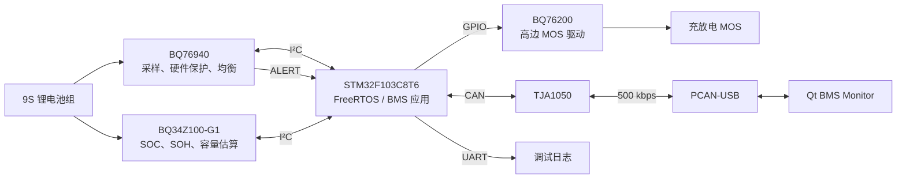
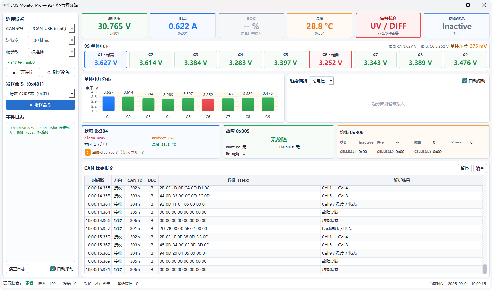

# STM32-BMS-48Pro

基于 **STM32F103C8T6、BQ76940、BQ34Z100-G1 与 BQ76200** 的 **9S 锂电池管理系统**，通过 FreeRTOS 组织采样、电量估算、保护、均衡、充放电控制与通信。配套 CAN 与 Qt 上位机，实现电池状态监控、故障诊断和查询应答。

**技术栈：** `C` · `STM32 HAL` · `FreeRTOS` · `I²C` · `CAN` · `C++17` · `Qt 6` · `Keil MDK` · `CMake`

[系统架构](#1-系统架构) · [核心功能](#2-核心功能) · [设计亮点](#3-核心设计亮点) · [模块设计](#4-关键模块设计) · [联调验证](#5-can-与-qt-联调) · [工程目录](#6-工程目录) · [设计文档](#7-设计文档)

## 1. 系统架构

STM32 协调 BQ76940 的电池监控、BQ34Z100-G1 的电量估算和 BQ76200 的功率驱动，并通过 CAN 与上位机交互。



## 2. 核心功能

| 功能 | 实现内容 |
| --- | --- |
| 电池采样 | 9S 单体电压、总压、电流、TS1 温度及电芯极值统计 |
| SOC/SOH 与容量读取 | 电量、健康状态、剩余容量、满充容量及循环次数 |
| 保护与告警 | 电压、温度、压差告警，温度保护与 OCD/SCD 事件处理 |
| 被动均衡 | 根据电芯状态选择目标并控制均衡 |
| 充放电控制 | BQ76200 输出管理、充放电阻断与强制关闭 |
| 故障诊断 | 启动、运行采样、硬件保护及 RTOS 创建异常分类处理 |
| CAN 通信 | 周期上报、状态查询、故障诊断与带序号 ACK |
| Qt 监控 | 电池数据、SOC/SOH、故障、均衡及原始 CAN 报文展示 |

## 3. 核心设计亮点

- **任务链组织业务：**采用 Sample → Protect → Balance → Control 明确正常处理顺序，故障任务独立响应事件。
- **决策与执行分离：**保护和均衡采用 Decide → ApplyHw → Commit，分别管理策略请求、硬件操作结果和软件状态。
- **共享资源分别管理：**BMS 上下文与 I²C 总线采用独立互斥锁，保护数据一致性和总线事务完整性，快照发送在锁外完成。
- **故障安全路径：**针对 Bring-up、RuntimeFault 和 HwFault 执行关断或放电阻断，并记录故障与处理结果，便于定位异常。
- **通信与业务解耦：**CAN 中断通过 Queue 投递报文，协议解析在任务中完成；Qt 通过状态显示、查询与带序号 ACK 核对板端响应。

## 4. 关键模块设计

### 4.1 FreeRTOS 任务协作

正常业务通过二值信号量接力；运行采样异常和 ALERT 事件分别通知 RuntimeTask、HwFaultTask，电量和通信任务独立运行。

```text
正常路径：SampleTask → ProtectTask → BalanceTask → ControlTask
运行异常：连续采样失败 → RuntimeTask → Safe-Off → ControlTask
硬件事件：BQ76940 ALERT → HwFaultTask → 故障处理 → ControlTask
```

| 任务 | 触发方式 | 优先级¹ | 职责 |
| --- | --- | --- | --- |
| HwFaultTask | ALERT 信号量 | +5 | 硬件保护事件处理 |
| SampleTask | 每轮采样后延时 500 ms | +4 | 采样、提交与失败统计 |
| RuntimeTask | 故障信号量 | +4 | Safe-Off 与重试 |
| ProtectTask / BalanceTask / ControlTask | 各自的信号量 | +3 | 保护、均衡与执行控制 |
| CANTask | 接收队列、1000 ms 上报检查 | +2 | 查询解析、状态发送与 ACK |
| GaugeTask | 1000 ms 周期 | +1 | 电量采集与提交 |
| AuxTask | 1000 ms 周期 | +1 | LED 与运行摘要 |

¹ 相对 `tskIDLE_PRIORITY` 的增量。

**Mutex** 分别保护 I²C 总线和 BMS 上下文，**Semaphore** 通知业务与故障任务，**Queue** 传递 CAN 接收帧。电量任务释放总线锁后再获取上下文锁，避免两锁嵌套；CAN 读取快照后在锁外发送。

### 4.2 保护与故障安全

软件告警包含 UV、OV、OT、UT 和 DIFF，使用进入/恢复阈值、迟滞与计数滤波。BQ76940 配置 OV/UV/OCD/SCD 硬件保护；软件温度保护与 OCD/SCD 事件处理形成相应的充放电限制，告警状态与执行动作分别管理。

| 路径 | 触发与处理 |
| --- | --- |
| Bring-up Fail-Safe | 初始化或自检失败，执行安全关闭、诊断上报与 STOP 故障保持 |
| RuntimeFault | 连续采样失败，锁存诊断并限制常规 AFE 写入，通知独立任务执行 Safe-Off |
| HwFault | ALERT 通知后读取 SYS_STAT，对 OCD/SCD 记录故障、阻断放电并同步执行状态 |
| RTOS 创建失败 | 任务或同步资源创建失败，安全关闭并上报初始化故障 |

Safe-Off 优先关闭 BQ76200 输出，再尝试关闭 BQ76940 FET 与 CELLBAL，记录操作结果；运行故障路径支持失败重试。OCD/SCD 恢复受显式恢复标志、故障位和相关告警条件约束，不因一次读取成功就直接恢复输出。

### 4.3 自动均衡

均衡采用压差进入/退出阈值与迟滞保持，结合电流绝对值上限和候选电芯电压下限筛选目标。

目标选择执行非相邻约束，并使用奇偶窗口分时轮换。动作按以下阶段完成：

```text
Decide：检查门控与故障状态，生成 START / STOP / NONE 请求
    ↓
ApplyHw：写入 CELLBAL1/2/3，并读回校验
    ↓
Commit：提交均衡状态、目标数量、标签与分时阶段
```

写入前再次检查故障相关限制，均衡状态通过 `0x306` 上报。参数定义与选择逻辑分别位于 `bq76940_app.c` 和 `bq76940_app_balance.c`。

### 4.4 充放电执行控制

保护模块输出限制状态，控制任务据此更新 BQ76200 执行层，由执行层统一管理 CHG_EN、DSG_EN、CP_EN 和 PCHG_EN，实现保护判断与 GPIO 输出解耦。

| 状态 | 含义 |
| --- | --- |
| OFF | 关闭全部驱动输出 |
| PRECHARGE | 定义预充输出映射：CP、PCHG 开启，CHG、DSG 关闭 |
| NORMAL_ON | 正常充放电 |
| CHG_BLOCK | 禁止充电，允许放电 |
| DSG_BLOCK | 禁止放电，允许充电 |
| CHG_DSG_BLOCK | 禁止充电和放电 |

运行故障优先进入 OFF，温度和硬件故障组合决定充放电限制；Force-Off 提供强制关闭入口。**PRECHARGE 已有状态定义和输出映射，当前状态更新逻辑未包含自动进入预充的转换流程。**

### 4.5 采样与电量管理

BQ76940 完成单体电压、电流和 TS1 温度读取，经校准换算后提交数据，计算单体求和总压、极值和压差。9S 逻辑电芯对应 VC1、VC2、VC5、VC6、VC7、VC10、VC11、VC12、VC15。

BQ34Z100-G1 在芯片内部估算电量，STM32 读取 SOC、SOH、容量及状态。整轮读取成功后统一提交样本，读取失败或过期时上报失效；电量用于监控，不参与当前充放电决策。容量按未缩放 mAh 解释，采用缩放配置时需匹配换算关系。

## 5. CAN 与 Qt 联调

### 5.1 CAN 协议与查询应答

板端采集与控制状态经 CAN 发送到 Qt；Qt 发起查询，板端返回数据和 ACK，形成监控与查询闭环。通信采用 **500 kbps、11 位标准数据帧、8 字节载荷**，多字节字段使用小端编码。

| CAN ID | 内容 |
| --- | --- |
| `0x301` | Pack 总压、电流 |
| `0x302` / `0x303` | C1～C4 / C5～C8 电压 |
| `0x304` | C9 电压、温度、告警、保护与方向状态 |
| `0x305` | 故障诊断 |
| `0x306` | 均衡状态与 CELLBAL 镜像 |
| `0x307` | 命令 ACK：命令、序号、结果和状态 |
| `0x308` | SOC、SOH、剩余/满充容量、有效标志与错误码 |
| `0x401` | PC 发出的查询命令与序号 |

接收路径为 **CAN ISR → Queue → CANTask → 协议解析**。查询命令 `0x01` 返回全部状态（`0x301～0x306`、`0x308`），`0x02` 查询故障，`0x03` 查询均衡，均使用 `0x307` 应答。当前命令用于状态查询，不包含远程强制开启 MOS。

### 5.2 Qt 监控与联调验证

Qt 展示 Pack 电压、电流、温度、9 节单体电压、SOC/SOH、故障和均衡状态，支持查询发送、ACK 解析和原始报文查看。电量区域悬停可查看容量；断连清空状态，电量数据无效或接收超时后隐藏旧值。



*实物联调截图展示电芯、Pack、故障与报文布局；截图为早期界面，电量显示以仓库程序为准。*

- **实物联调：**通过 PCAN 与 Qt 查看状态帧、查询响应和原始报文，保留 [PCAN 查询与 ACK 截图](docs/images/pcan-query-all-ack.png)。
- **编译检查：**固件 ARM Compiler 5 构建为 0 错误、0 警告；Qt 6.8.3 / MinGW 构建通过。
- **自动化测试：**电量采样与协议测试、普通及高 DPI 布局测试共三项通过，覆盖失败恢复、数据编码与界面布局。

自动化测试范围为软件逻辑与布局，不代表电量精度或全部硬件故障场景验证。

## 6. 工程目录

以下仅展开主要维护的应用、板级驱动、上位机和文档；同名源文件与头文件合并标注。

```text
STM32-BMS-48Pro/
├── Users/
│   ├── main.c / bms_config.h / bms_log.h   # 启动、任务参数与日志配置
│   ├── FreeRTOSConfig.h                   # RTOS 配置
│   └── App/
│       ├── bms_tasks.c/.h                 # 任务编排与同步
│       ├── bq76940_app.c/.h               # 上下文、默认配置与自检
│       ├── bq76940_app_sample.c/.h        # 采样与换算
│       ├── bq76940_app_protect.c/.h       # 告警与保护
│       ├── bq76940_app_balance.c/.h       # 均衡策略与提交
│       ├── bq76940_app_control.c/.h       # 执行输入组织
│       ├── bq76940_app_hw_fault.c/.h      # 硬件故障处理
│       ├── bq76940_app_runtime_diag.c/.h  # 运行诊断与 Safe-Off 记录
│       ├── bq76940_app_can.c/.h           # CAN 上报、查询与 ACK
│       └── bq34z100_app.c/.h              # 电量采集与有效状态
├── Drivers/BSP/
│   ├── bq76940_drv/                       # AFE 寄存器与采样接口
│   ├── bq76940_alarm/、bq76940_protect/    # 告警算法与保护配置
│   ├── bq34z100_drv/                      # 电量计数据命令
│   ├── bq76200_exec/、bq76200_exec_port/   # 执行状态机与 GPIO 端口
│   └── soft_i2c1/、can/、io_ctrl/、led/    # 总线与板级接口
├── BMS-QT/BMS_Monitor/
│   ├── mainwindow.cpp/.h、mainwindow.ui   # 界面与交互
│   ├── canconnection.cpp/.h              # 设备连接与 CAN 收发
│   ├── bmscanprotocol.cpp/.h              # 数据模型与协议解析
│   ├── chartwidgets.cpp/.h               # 图形控件
│   └── tests/                            # 电量协议与布局测试
└── docs/
    ├── can-protocol.md                    # CAN 协议
    ├── diagrams-drawio/                   # 业务流程图源文件
    └── images/                           # 界面与联调截图
```

## 7. 设计文档

| 主题 | 阅读入口 |
| --- | --- |
| 启动与任务创建 | [全局流程](docs/diagrams-drawio/BMS-48Pro_全局启动与任务创建流程图.drawio)、[Bring-up 与自检](docs/diagrams-drawio/Bring-up与自检流程图.drawio) |
| 数据采样 | [采样流程](docs/diagrams-drawio/采样流程.drawio) |
| 均衡策略 | [均衡决策](docs/diagrams-drawio/BQ76940_均衡决策流程.drawio)、[均衡任务](docs/diagrams-drawio/均衡任务流程.drawio) |
| 故障处理 | [硬件故障](docs/diagrams-drawio/HwFault_V2_Flow.drawio)、[运行诊断](docs/diagrams-drawio/runtimeDiag.drawio) |
| CAN 通信 | [协议定义](docs/can-protocol.md)、[收发与命令闭环](docs/diagrams-drawio/CAN收发与命令闭环流程图v1.drawio) |

`.drawio` 文件可使用 diagrams.net / draw.io 查看和编辑。

---

**Evan · Embedded Developer** · [GitHub / Secret-G](https://github.com/Secret-G)
