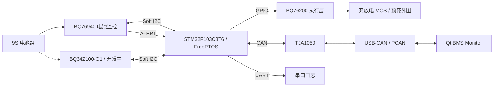
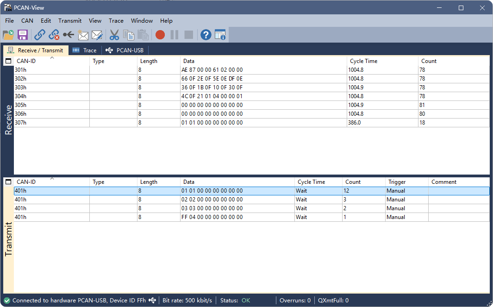

# STM32-BMS-48Pro

基于 **STM32F103C8T6 + BQ76940** 的 9S 锂电池管理系统，
结合 FreeRTOS、CAN 与 Qt 上位机，实现从电池数据采集、保护与均衡到 PC 端状态监控的完整链路，
并正在接入 **BQ34Z100-G1 SOC/SOH 电量管理**。

**技术栈：** `C` · `STM32 HAL` · `FreeRTOS` · `Soft I2C` · `CAN` · `C++17` · `Qt 6` · `Keil MDK` · `CMake`


*Qt 实物联调界面：PCAN-USB、500 kbps、9S 单体电压、Pack 状态、告警、故障、均衡与原始 CAN 报文。截图中的 SOC 和趋势曲线尚未接入。*

## 1. 项目概述

### 1.1 项目背景

本项目围绕真实 9S 电池平台，将芯片驱动、保护策略、任务调度和 PC 监控整合为一套 BMS 应用。开发从 BQ76940 硬件调试出发，逐步完成应用模块拆分、FreeRTOS 迁移和 CAN / Qt 联调。

工程重点是让采样、保护、均衡和执行控制协同工作，并在采样失败、硬件保护触发等情况下保留明确的处理路径与可观察的诊断状态。

### 1.2 项目目标

- 完成 9S 电池的电压、电流、温度采集与状态管理。
- 实现软件告警、硬件保护事件处理、自动均衡和执行层控制。
- 通过 FreeRTOS 拆分任务，明确共享状态与 I2C 总线的访问边界。
- 实现 CAN 周期上报、查询命令与 ACK 响应，并通过 Qt 展示实时状态。
- 接入 BQ34Z100-G1 电量计，逐步补齐 SOC/SOH、容量学习和上位机显示链路。

### 1.3 当前完成情况

**BMS 核心固件、FreeRTOS 任务协作和 CAN 查询/ACK 已实现，Qt 已接入实物数据。** 上位机可查看 9S 电压、Pack 电流、温度、告警、故障和均衡状态，并显示原始 CAN 报文。

BQ34Z100 电量管理、SOC/SOH 通讯接入与历史趋势曲线正在开发，完成度统一见第 13 节。

## 2. 项目亮点

| 工程亮点 | 设计与实现 |
| --- | --- |
| **FreeRTOS 任务解耦** | Sample → Protect → Balance → Control，通过 Semaphore 串联业务链路，Mutex 管理共享 I2C 与状态上下文 |
| **CAN 中断与业务解耦** | RX ISR → Queue → CANTask，中断负责取帧，任务完成周期上报、查询解析和带序号 ACK |
| **均衡决策与硬件操作分离** | Decide → ApplyHw → Commit，结合非相邻筛选、奇偶分时、迟滞和 CELLBAL 读回校验 |
| **故障后的写入约束** | RuntimeFault 锁存后禁止常规 AFE 写入，独立任务执行 Safe-Off、记录结果并处理重试 |
| **保护与恢复条件管理** | 分离软件告警和硬件故障，结合迟滞、DSG 阻断与显式恢复条件组织保护动作 |
| **执行输出集中控制** | BQ76200 状态机统一管理 CHG、DSG、CP、PCHG，提供 Force-Off 入口 |
| **采样到界面的完整链路** | 9S 通道映射、校准换算、CAN 打包与 Qt 解析衔接，直观展示电压极值、压差及诊断状态 |
| **Qt 模块划分** | CanConnection、BmsCanProtocol 与 MainWindow 分别负责设备、协议和界面，便于扩展报文与展示功能 |

## 3. 系统总体架构

### 3.1 系统架构图



*实线表示核心功能链路，虚线表示开发中的电量计接入；图中展示功能关系。*

### 3.2 数据流 / 控制流

**数据流：**电芯与传感器 → BQ76940 → I2C 原始采样 → 换算与状态提交 → CAN 状态帧 → Qt 解析与展示。

**控制流：**采样状态 → 软件保护判断 → 均衡决策 → 执行层更新；硬件 ALERT 和运行异常通过独立路径触发故障处理。

**PC 查询链路：**Qt 发送 `0x401` → CAN 接收队列 → CANTask 解析 → 返回请求数据与 `0x307` ACK。

### 3.3 主要模块关系

采样模块将数据提交到 BMS 上下文，保护与均衡模块据此生成动作，驱动完成寄存器访问，控制模块更新 BQ76200 执行层。CAN 使用状态快照组织报文，Qt 解析后刷新界面，使业务判断、硬件操作与数据显示各自承担明确职责。

## 4. 硬件平台

| 小节 | 模块 | 当前用途 |
| --- | --- | --- |
| 4.1 | STM32F103C8T6 | 主控，负责任务调度、I2C 访问、CAN 通讯与 GPIO 控制 |
| 4.2 | BQ76940 | 9S 电压、电流、TS1 温度采样，硬件保护状态与被动均衡控制 |
| 4.3 | BQ34Z100-G1 | 电量计，SOC/SOH 与容量读取框架已实现，系统接入开发中 |
| 4.4 | BQ76200 | 高边驱动执行层，已实现控制接口与状态机 |
| 4.5 | TJA1050 | CAN 物理层收发器，当前通讯为 500 kbps |
| 4.6 | 9S 电池组及外围硬件 | 电芯连接、采样电阻、NTC、均衡与充放电外围 |

当前软件接口包括 Soft I2C（PB8/PB9）、BQ 唤醒控制（PA8）、LED（PA15）、CAN 和 UART。接口变更应同步核对板卡接线与 BSP 配置。

## 5. 软件架构

### 5.1 软件分层

```text
Application：Users/App
    采样、保护、均衡、控制、诊断、CAN 协议、电量计应用、任务编排
        ↓
Driver / BSP：Drivers/BSP
    BQ 芯片驱动、执行端口、Soft I2C、CAN、GPIO、LED 等
        ↓
HAL / 底层支持：Drivers/STM32F1xx_HAL_Driver 等
        ↓
Hardware：STM32、监控芯片、执行器与总线
```

应用层组织业务，`Drivers/BSP` 封装芯片驱动与板级接口，底层通过 HAL 和 GPIO 等接口访问硬件。

### 5.2 模块划分

| 模块 | 主要职责 |
| --- | --- |
| `bq76940_app` | 应用上下文、默认配置、Bring-up 与自检 |
| `bq76940_app_sample` | 原始采样组织、换算与数据提交 |
| `bq76940_app_protect` | 软件告警和保护动作处理 |
| `bq76940_app_balance` | 均衡决策、硬件应用与状态提交 |
| `bq76940_app_control` | 执行层输入组织与状态更新 |
| `bq76940_app_runtime_diag` | 运行时采样失败诊断与 Safe-Off 状态管理 |
| `bq76940_app_hw_fault` | OCD/SCD 识别、阻断、锁存与条件恢复 |
| `bq76940_app_can` | 状态帧、诊断帧、命令解析与 ACK |
| `bq34z100_app` | 电量计数据读取与有效性记录 |
| `bms_tasks` | 任务创建、同步、共享资源访问与各业务调用 |

### 5.3 全局 BMS 状态设计

`BQ76940_AppCtx_t` 汇总电压、电流、温度、告警、保护、均衡、运行诊断和硬件故障状态。任务在互斥保护下读取快照或提交结果，使算法计算与硬件访问尽量在全局状态锁之外完成。

电量计使用独立的 `BQ34Z100_AppCtx_t` 保存 SOC、SOH、容量和有效性等信息；当前尚未形成电量计数据到 CAN、Qt 的完整链路。

## 6. BMS 核心功能

### 6.1 BQ76940 Bring-up

启动阶段完成唤醒、基础寄存器访问、ADCGAIN/ADCOFFSET 校准参数读取、CC_CFG、SYS_CTRL 和保护寄存器配置，并进行采样链路自检。初始化失败进入启动故障处理，执行安全关断、诊断上报与故障保持。

流程源文件：[Bring-up 与自检流程图](docs/diagrams-drawio/Bring-up与自检流程图.drawio)。

### 6.2 数据采集

| 数据 | 实现内容 |
| --- | --- |
| 单体电压 | 读取原始 ADC，换算 mV，统计最高/最低电芯及压差 |
| Pack 电压 | 根据当前 9S 单体电压求和 |
| 电流 | 读取 BQ76940 CC 数据，换算 mA，记录方向 |
| 温度 | 读取 TS1，完成热敏电阻温度换算，以 0.1°C 保存 |

当前逻辑电芯 C1～C9 对应的 BQ76940 物理通道为：

```text
C1   C2   C3   C4   C5   C6    C7    C8    C9
VC1  VC2  VC5  VC6  VC7  VC10  VC11  VC12  VC15
```

Qt 显示的 C 序号与驱动中的 VC 标签需要按此映射区分。采样流程见 [采样流程图](docs/diagrams-drawio/采样流程.drawio)。

### 6.3 软件告警与硬件保护

软件告警包括 UV、OV、DIFF、OT 和 UT，采用进入/恢复阈值、迟滞与计数滤波。应用根据告警和已有保护状态决定动作，恢复路径也检查相关告警，避免不满足条件时重新开启。

BQ76940 侧配置 OV/UV/OCD/SCD 硬件保护，软件通过 SYS_STAT 和 ALERT 路径处理硬件事件。OCD/SCD 处理包含 DSG 阻断、故障记录和执行层同步。

当前还实现了带条件的一次恢复路径：需要显式设置恢复标志、DSG 处于阻断状态、OCD/SCD 当前位已清除，且没有 UV/OT 告警。该恢复入口不属于当前 CAN 查询命令。

### 6.4 自动均衡

均衡模块根据电压、压差、电流及故障状态判断是否允许动作，通过多电芯 Balance Mask、非相邻筛选、奇偶窗口轮换和迟滞保持组织被动均衡。

```text
BalanceDecide：读取状态，生成 START / STOP / NONE 请求
    ↓
BalanceApplyHw：写入 CELLBAL1/2/3，并读回校验
    ↓
BalanceCommit：提交 active、mask、目标数量、标签与 phase
```

写入前检查故障相关限制，减少旧请求在故障发生后继续作用于硬件的风险。均衡状态通过 `0x306` 上报。

流程源文件：[均衡决策](docs/diagrams-drawio/BQ76940_均衡决策流程.drawio)、[均衡任务](docs/diagrams-drawio/均衡任务流程.drawio)。

### 6.5 BQ34Z100-G1 电量管理

当前已实现 SOC、SOH、剩余容量、满充容量、电压、电流、温度、循环次数和状态标志等读取逻辑，并维护数据有效性与错误码。

GaugeTask 通过共享 I2C 总线周期读取电量计，当前由 `BMS_ENABLE_GAUGE_TASK = 0U` 默认关闭。参数配置、校准、Qmax/容量学习和 CAN / Qt 接入属于后续电量管理开发内容。

### 6.6 BQ76200 执行控制

执行层使用统一接口管理 CHG_EN、DSG_EN、CP_EN 和 PCHG_EN，并提供 Force-Off。控制任务根据保护与诊断状态组织执行输入。

| 状态 | 含义 |
| --- | --- |
| OFF | 全部关闭 |
| PRECHARGE | 已定义预充状态及输出映射 |
| NORMAL_ON | 正常充放电 |
| CHG_BLOCK | 禁止充电 |
| DSG_BLOCK | 禁止放电 |
| CHG_DSG_BLOCK | 充放电均禁止 |

当前 PRECHARGE 提供状态定义与输出映射，完整预充流程仍需完善电压判据、超时处理与负载验证。

### 6.7 异常安全处理

| 异常 | 触发来源 | 处理思路 |
| --- | --- | --- |
| BringUp Fault | 初始化或自检失败 | 启动 Safe-Off、诊断帧、LED 提示与 STOP 故障保持 |
| Runtime Fault | 连续运行采样失败 | 锁存诊断、禁止常规 AFE 写入、触发 Safe-Off 与失败重试 |
| HwFault | BQ76940 OCD/SCD 事件 | 读取状态、DSG 阻断、故障记录、同步执行层 |
| RTOS Init Fault | 任务或同步资源创建失败 | 启动 Safe-Off 并发送专用故障类型 |

Safe-Off 优先关闭 BQ76200 执行输出，并尝试关闭 BQ76940 FET 与 CELLBAL，记录操作返回结果。通讯失败时必须区分关断请求和硬件实际关断结果。

流程源文件：[RuntimeDiag](docs/diagrams-drawio/runtimeDiag.drawio)、[HwFault V2](docs/diagrams-drawio/HwFault_V2_Flow.drawio)。

## 7. FreeRTOS 多任务设计

### 7.1 任务划分

下表对应当前 `bms_config.h` 和 `bms_tasks.c`。优先级为相对 `tskIDLE_PRIORITY` 的增量。

| 任务 | 触发方式 / 周期 | 优先级 | 职责 |
| --- | --- | --- | --- |
| SampleTask | 采样循环，末尾延时 500 ms | +4 | 数据采集、状态提交、采样异常统计 |
| ProtectTask | 信号量 | +3 | 软件告警与保护处理 |
| BalanceTask | 信号量 | +3 | 均衡决策、写入与提交 |
| ControlTask | 信号量 | +3 | BQ76200 状态更新 |
| GaugeTask | 1000 ms，默认关闭 | +1 | BQ34Z100 周期读取 |
| RuntimeTask | 信号量 | +4 | RuntimeFault Safe-Off 与重试 |
| HwFaultTask | 硬件事件信号量 | +5 | ALERT、OCD/SCD 处理 |
| CANTask | RX 队列 + 1000 ms 上报检查 | +2 | 接收解析、状态发送与 ACK |
| AuxTask | 1000 ms | +1 | LED 与运行摘要 |

### 7.2 正常任务链路

```text
SampleTask → ProtectTask → BalanceTask → ControlTask
```

这是正常业务路径。异常分支可能跳过均衡或直接通知控制任务；CAN 和辅助任务独立运行。

### 7.3 异常任务链路

```text
连续采样失败 → RuntimeTask → Safe-Off → ControlTask
BQ76940 ALERT → HwFaultTask → 故障处理 → ControlTask
```

启动阶段失败在进入正常调度前处理。整体流程见 [全局启动与任务创建流程图](docs/diagrams-drawio/BMS-48Pro_全局启动与任务创建流程图.drawio)。

### 7.4 任务间同步

| 机制 | 用途 |
| --- | --- |
| Mutex | 保护共享 I2C 总线和 BMS 上下文 |
| Binary Semaphore | 正常任务接力、运行异常与硬件事件通知 |
| Queue | 将 CAN 接收中断中的报文交给 CANTask |

### 7.5 I2C Mutex

BQ76940 与电量计任务使用共享 I2C 访问保护。获取总线锁后执行硬件事务，结束后释放；超时作为错误交给相应业务处理。

### 7.6 BMS Context Mutex

全局状态锁用于快照读取与结果提交，避免多任务同时修改上下文。采样换算、算法判断和报文组织尽量使用局部数据，减少持锁时间。

## 8. CAN 通讯设计

### 8.1 CAN 总体设计

```text
BMS 固件 ←→ STM32 CAN / TJA1050 ←→ USB-CAN ←→ Qt / PCAN-View
```

当前使用 **500 kbps、标准数据帧**。状态和命令报文使用 8 字节数据，多字节字段按小端编码。

### 8.2 周期状态上报

| CAN ID | 内容 |
| --- | --- |
| `0x301` | Pack 总压、电流 |
| `0x302` | C1～C4 电压 |
| `0x303` | C5～C8 电压 |
| `0x304` | C9 电压、TS1 温度、告警、保护、均衡目标、电流方向 |
| `0x305` | 故障诊断：None / BringUp / Runtime / HwFault / RTOS Init |
| `0x306` | 均衡 active、目标数量、CELLBAL1/2/3、phase、目标标签 |

`0x305` 的启动异常由对应启动故障路径发送；正常周期任务发送运行诊断或无故障状态。

### 8.3 PC 命令

PC 通过 `0x401` 发送查询：Byte0 为命令，Byte1 为序号，其余保留。

| 命令 | 功能 |
| --- | --- |
| `0x01` | 请求全部状态 `0x301～0x306` |
| `0x02` | 请求故障诊断 `0x305` |
| `0x03` | 请求均衡状态 `0x306` |

### 8.4 ACK

BMS 使用 `0x307` 返回原命令、序号、结果、详情、状态标志与故障类型。结果枚举包含 OK、UNKNOWN_CMD、INVALID_DLC、REJECTED 和 EXEC_FAIL，便于区分请求处理结果。

### 8.5 CAN RX 中断 + Queue

```text
CAN FIFO → ISR / HAL 回调 → xQueueSendFromISR
    → CAN RX Queue → CANTask → Protocol Parser → 数据响应 + ACK
```

中断负责取帧和投递队列，业务解析在任务中完成；队列满时记录丢帧计数。流程见 [CAN 收发与命令闭环](docs/diagrams-drawio/CAN收发与命令闭环流程图v1.drawio)。

### 8.6 详细 CAN 协议

完整字节表、标志位和示例见 [CAN 通讯协议](docs/can-protocol.md)。当前协议尚未包含电量计 SOC/SOH 字段。

## 9. Qt BMS Monitor 上位机

### 9.1 上位机简介

上位机位于 `BMS-QT/BMS_Monitor`，采用 C++17、Qt Widgets 和 Qt SerialBus。`CanConnection` 管理设备，`BmsCanProtocol` 解析报文，`MainWindow` 组织状态展示和交互，自定义图形组件绘制单体电压分布。

### 9.2 CAN 连接

通过 Qt `peakcan` 插件扫描和连接 PCAN 设备，支持设备刷新、连接/断开、波特率设置和连接日志。当前截图使用 PCAN-USB `usb0`、500 kbps、标准帧。

### 9.3 Pack 状态显示

展示总电压、电流和温度，并将原始 mV、mA、0.1°C 数据转换为便于阅读的 V、A、°C。

### 9.4 9S 单体电压显示

以电压卡片和柱状图展示 C1～C9，突出最高/最低电芯与单体压差，辅助观察电芯一致性和均衡状态。

### 9.5 SOC / SOH

SOC 区域已预留，当前显示“电量计未接入”；SOC/SOH 的 CAN 字段、协议解析与数据显示正在开发。

### 9.6 告警 / 故障显示

解析 `0x304` 告警与保护字段、`0x305` 诊断字段及 `0x306` 均衡字段。软件告警与故障诊断分别展示，因此可以同时出现“UV / DIFF”和“无故障”，两者对应不同的状态来源。

### 9.7 实时数据曲线

界面已预留趋势曲线区域与选择控件，历史数据缓存、时间轴与曲线刷新正在开发。当前单体电压柱状图展示各电芯的即时电压分布。

### 9.8 CAN 命令交互

界面提供查询命令选择和发送入口，代码具备 ACK 解析。原始报文区展示时间戳、方向、ID、DLC、数据与解析结果，支持暂停显示与清空。

上位机运行效果见首页截图，联调数据与日志见第 10 节。

## 10. 实物测试与验证

### 10.1 实物平台

联调平台由 9S 电池组、BMS 板、PCAN-USB 和 PC 组成，CAN 用于上位机通讯，UART 用于观察启动与运行日志。

### 10.2 PCAN-View 测试

PCAN-View 联调覆盖 `0x301～0x306` 周期上报、三种查询命令、`0x307` ACK 和未知命令响应。下图展示周期状态帧与请求全部状态的 ACK：



对应报文：

```text
PC → BMS：0x401  01 01 00 00 00 00 00 00  请求全部状态
BMS → PC：0x301～0x306                   返回状态帧
BMS → PC：0x307  01 01 00 00 00 00 00 00  ACK：命令 01，序号 01，OK
```

ACK 中命令与序号均为 `0x01`，结果为 OK；状态标志为 `0x00`，与截图中未开启均衡的状态一致。CAN 波特率为 500 kbit/s，连接状态为 OK。

### 10.3 Qt 上位机联调

当前 [Qt 运行截图](docs/images/qt-bms-monitor.png) 显示：

- PCAN-USB 已连接，波特率为 500 kbps。
- Pack 总压 30.765 V、电流 0.622 A、温度 28.8°C。
- 9 节电芯数据已显示，最高 C1 为 3.627 V，最低 C6 为 3.252 V，压差 375 mV。
- 告警为 UV / DIFF，均衡为 Inactive，故障诊断区显示无故障。
- 原始报文区可见 `0x301～0x306`，接收计数为 102，解析错误计数为 0。

### 10.4 串口运行日志

串口运行日志示例：

```text
[BMS] P=35346mV MAX=VC1:3967mV MIN=VC6:3842mV D=125mV I=2mA T=291dC ALM=00 PROT=20 BAL=1:VC1 SYS=00
```

字段涵盖总压、极值、压差、电流、温度、告警、保护、均衡和 SYS_STAT。此示例与当前 Qt 截图属于不同运行时刻。

## 11. 项目目录

```text
STM32-BMS-48Pro/
├── Users/
│   ├── main.c                         # 启动、自检与启动异常处理
│   ├── bms_config.h                   # 任务参数、开关与测试配置
│   ├── bms_log.h                      # 日志配置
│   └── App/                           # BMS 应用与 FreeRTOS 任务
├── Drivers/
│   ├── BSP/                           # BQ 驱动、执行端口和板级接口
│   └── STM32F1xx_HAL_Driver/           # HAL 驱动
├── Middlewares/                       # FreeRTOS 等中间件
├── BMS-QT/
│   └── BMS_Monitor/                    # Qt 上位机与 CMake 工程
├── docs/
│   ├── can-protocol.md                # CAN 字节定义与示例
│   ├── diagrams-drawio/               # 流程图源文件
│   └── images/                        # README 图片
└── Projects/
    └── MDK-ARM/                       # Keil 工程
```

**固件入口：**使用 Keil MDK 打开 [BMS_Rebuild_add_34z100.uvprojx](Projects/MDK-ARM/BMS_Rebuild_add_34z100.uvprojx)。启动前核对板卡接线、保护参数与 `bms_config.h` 功能开关；当前电量计任务默认关闭。

**上位机入口：**使用 Qt Creator 打开 [CMakeLists.txt](BMS-QT/BMS_Monitor/CMakeLists.txt)。工程要求 CMake ≥ 3.19、Qt 6 ≥ 6.5、C++17，依赖 Core、Widgets 和 SerialBus；连接实物需要可用的 Qt PeakCAN 插件及相应 PCAN 驱动/运行库。运行后选择设备、500 kbps 和标准帧，再连接查看状态。

**串口：**当前初始化波特率为 115200。

## 12. 项目文档

| 文档主题 | 阅读入口 |
| --- | --- |
| 项目概述与硬件平台 | 本 README 第 1～4 节 |
| FreeRTOS 软件架构 | 第 5、7 节；[启动与任务创建流程图](docs/diagrams-drawio/BMS-48Pro_全局启动与任务创建流程图.drawio) |
| 系统启动与数据采集 | [Bring-up 流程](docs/diagrams-drawio/Bring-up与自检流程图.drawio)、[采样流程](docs/diagrams-drawio/采样流程.drawio) |
| 保护与异常处理 | [HwFault 流程](docs/diagrams-drawio/HwFault_V2_Flow.drawio)、[RuntimeDiag](docs/diagrams-drawio/runtimeDiag.drawio) |
| 自动均衡策略 | [均衡决策](docs/diagrams-drawio/BQ76940_均衡决策流程.drawio)、[均衡任务](docs/diagrams-drawio/均衡任务流程.drawio) |
| CAN 通讯协议 | [详细协议](docs/can-protocol.md)、[收发与命令闭环](docs/diagrams-drawio/CAN收发与命令闭环流程图v1.drawio) |
| Qt 上位机设计 | 本 README 第 9 节 |
| 实物联调与运行日志 | 本 README 第 10 节 |

`.drawio` 流程图可使用 diagrams.net / draw.io 打开编辑；首页架构图使用 Mermaid。

## 13. 项目状态与后续计划

| 模块 | 状态 | 当前范围 |
| --- | --- | --- |
| BQ76940 采样 | 已实现 | 9S 电压、电流、温度采集，已接入 Qt 显示 |
| 软件告警与硬件保护 | 已实现 | 告警判定、OCD/SCD 处理、故障锁存与条件恢复 |
| 自动均衡 | 已实现 | 多电芯选择、奇偶轮换、迟滞与读回校验 |
| BQ76200 执行层 | 已实现 | 控制接口与状态机；完整预充流程仍需完善 |
| FreeRTOS | 已实现 | 任务调度、信号量、互斥锁与接收队列 |
| CAN | 已实现 | 周期状态上报、查询命令与带序号 ACK |
| 分级异常 / Safe-Off | 已实现 | 启动、运行与硬件异常处理，关断结果记录和重试 |
| Qt Monitor | 已联调基本数据链路 | CAN 连接、状态显示、原始报文；具备查询与 ACK 解析代码 |
| BQ34Z100-G1 | 开发中 | 读取框架已实现，GaugeTask 默认关闭；继续完善配置、容量学习与系统接入 |
| SOC/SOH CAN 与 Qt 接入 | 开发中 | 电量计字段与显示链路尚未接入 |
| 历史趋势曲线 | 开发中 | UI 已预留，历史数据与曲线尚未接入 |
| Flash 参数管理 | 计划中 | 参数保存与配置版本管理 |

下一步重点：

- 完善 BQ34Z100 参数配置、校准和容量学习，接通 SOC/SOH 的 CAN 与 Qt 链路。
- 实现 Qt 历史数据缓存、时间轴与趋势曲线。
- 增加 Flash 参数管理，扩展协议与上位机配置能力。
- 扩展保护恢复、预充、故障关断、异常通讯与长期运行测试。

## 14. 声明

本项目用于嵌入式学习、工程实践与作品展示，目前的实现和测试范围以文档记录为准，尚不代表完成产品级验证或认证。

当前 CAN 仅开放状态查询命令，不提供远程强制开启 MOS、修改保护阈值或强制均衡接口。硬件测试需结合实际电芯、采样与功率回路参数，在具备限流和测量条件的环境下进行。

## 15. 作者

**Evan**

Embedded Developer

GitHub：[Secret-G](https://github.com/Secret-G)
